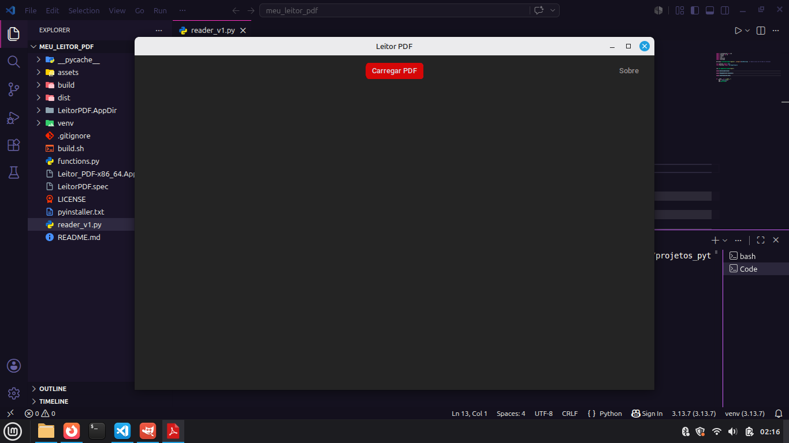

# 📄 Leitor de PDF (v1)


Aplicativo desktop desenvolvido em **Python** utilizando
**CustomTkinter** para leitura de arquivos PDF com renderização em
imagem.

------------------------------------------------------------------------

## 📷 Preview

<p align="center">
  
</p>

------------------------------------------------------------------------

## 🚀 Funcionalidades

-   📂 Abertura de arquivos PDF
-   🖼️ Renderização de páginas como imagem (RGB/RGBA)
-   📜 Scroll vertical com carregamento progressivo
-   ⚡ Carregamento assíncrono (evita travamentos)
-   🌙 Interface em modo escuro (Dark Mode)
-   🪟 Popup "Sobre" com informações do app
-   🎯 Interface centralizada e responsiva

------------------------------------------------------------------------

## 🧠 Tecnologias utilizadas

-   Python 3
-   CustomTkinter
-   PyMuPDF (fitz)
-   Pillow (PIL)
-   Tkinter

------------------------------------------------------------------------

## 🧱 Estrutura do projeto (v1)
```
📂 pdf-reader/
│
├── reader_v1.py      # Interface principal
├── functions.py      # Lógica de carregamento do PDF
├── 📂 assets/        # Ícones da aplicação
│ ├── docpdf.ico
│ └── docpdf.png
├── preview.png       # Imagem do app aberto
├── requirements.txt  # Dependências do projeto
├── LICENSE           # Licença MIT
└── README.md         # Documentação do projeto
```
------------------------------------------------------------------------

## ⚙️ Como executar

1.  Instale as dependências:

- pip install customtkinter pymupdf pillow

2.  Execute o arquivo principal:

- python reader_v1.py

------------------------------------------------------------------------

## 🔄 Como funciona

O aplicativo:

1.  Abre um seletor de arquivos
2.  Carrega o PDF usando PyMuPDF
3.  Converte cada página em imagem
4.  Exibe as páginas dentro de um scroll
5.  Carrega em blocos para evitar travamento

------------------------------------------------------------------------

## 🧩 Arquitetura

-   `reader_v1.py` → Interface gráfica
-   `functions.py` → Processamento e renderização

Separação de responsabilidades para facilitar manutenção e evolução.

------------------------------------------------------------------------

## 📈 Melhorias futuras (v2)

-   🔍 Zoom nas páginas
-   📑 Navegação por páginas
-   🧭 Miniaturas laterais
-   🔎 Busca por texto no PDF
-   ⏳ Indicador de carregamento
-   ⚠️ Tratamento de erros mais robusto

------------------------------------------------------------------------

## 📜 Licença

Distribuído sob a **Licença MIT**.

Este projeto é open source e pode ser utilizado livremente para fins educacionais e de aprendizado.

------------------------------------------------------------------------

## 👨‍💻 Autor

**Danilo Santos**  
🐙 GitHub: https://github.com/danilo-santos-python  
🌐 Repositório: https://github.com/danilo-santos-python/pdf-reader

------------------------------------------------------------------------

⭐ Se este projeto foi útil para você, deixe uma estrela no repositório.

